# Basis Functions

The feature-based scheduler uses a modified Markov Decision Process to select where the best spot on the sky to observe would be. In these sub directories, we run a few simplified surveys to illustrate how they effect the decision process.

There are three basis functions that we tend to use.

1. The `M5_diff_basis_function` combines the current skybrightness, seeing, and airmass all-sky maps to compute the 5-sigma depth at every point in the sky. It then computes the difference between the current 5-sigma map and an all-sky map that has the expected "best" 5-sigma depth a healpixel would reach. This can be thought of as computing how large a penalty one incurrs by observing any particular point in the sky. This basis function helps ensure reasonable filter choices are made, the penalty for observing in bright time is much lower in red filters than in blue filters.

2. The `Target_map_basis_function` tracks the progress of the survey and compares it to the goal map. This basis function rewards areas that have been under-observed and penalizes those that have been over-observed.

3. The `Slewtime_basis_function` rewards short slews and penalizes long slews. 

Other basis functions used in these examples include `Strict_filter_basis_function` that rewards staying in the same filter (to prevent excessive filter changing), and some functions that mask the zenith and region around the moon.

The final reward map is a linear combination of the above basis functions. The free parameters of the scheduler are the weights given to each basis function. The weights can be thought of as converting the different units of our observing desires to a common ground. The weights allow us to speciy that X magnitudes of lost depth is equal to observing a part of the sky that is Y observations behind. 

## Single Filter

The 1filter example notebook runs a serries of simulated surveys where the weight on each basis function is increased. 

| | Baseline  | Slewtime | m5  | Target Map  | 
|-- | :--------:  | :-------: | :----: | :------: |
| N obs| 24,611 |  25,012 | 24,010 | 23,106  |
|Alt-az | 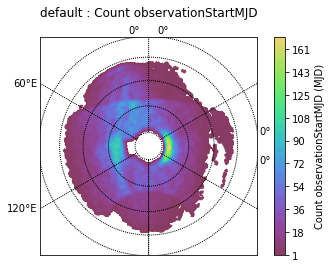 |  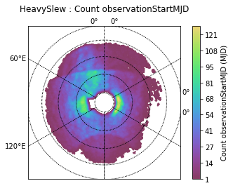 | 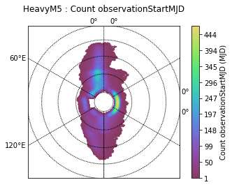 | 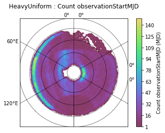 |
|RA,Dec |  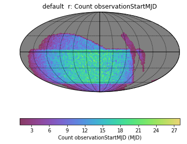|  |  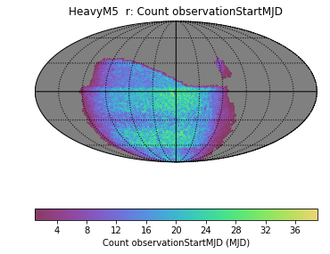|  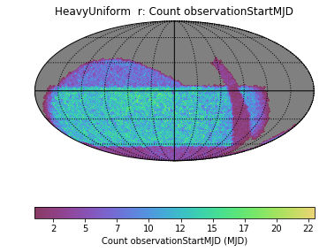| 

Hopefully it is clear that if any one basis function is set to dominate, the resulting survey has some undesireable features. 

* When the slewtime dominates, the number of observations is maximized, but part of the galactic plane has been very over-observed (the moon masked a large part of the sky, and the algorithm refused to make a large slew around it).
* When the 5-sigma depth dominates, observations are taken very close to the meridian (that's good), but 
* When the target map dominates, the scheduler falls to the airmass limit to try and observe areas that have not yet been observed. But the resulting RA,Dec map is very smooth and a good match to the desired ratio of observations in the different regions.

The Baseline column shows the results of manually balancing the weights of the basis functions to try and find a balance.

## Two filters

We can see what happens if we attempt to observe with 2 filters. Now the `Strict_filter_basis_function` becomes relevant, and the final column shows what happens if we give no weight to restricting filter changes.

| | Baseline  | Slewtime | m5  | Target Map  | Filter Change (removed) |
|-- | :--------:  | :-------: | :----: | :------: | :------: |
| N obs| 24,621 |  24,960 | 24,059 | 23,206  | 24,003 |
|Alt-az | 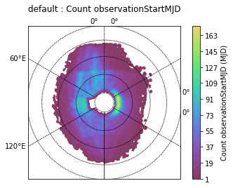 |  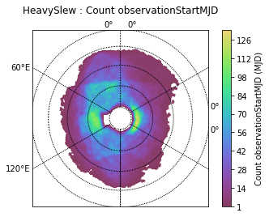 | 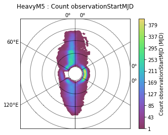 | 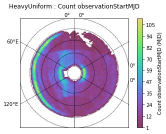 | 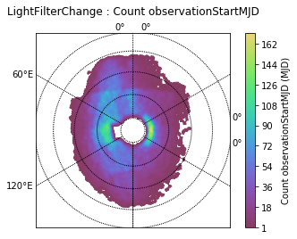 | 
|RA,Dec g |  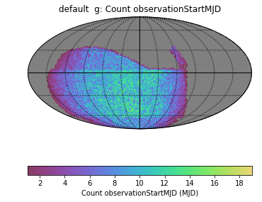|  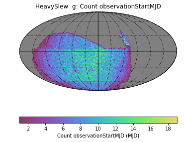|  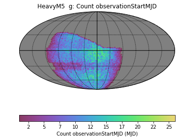|  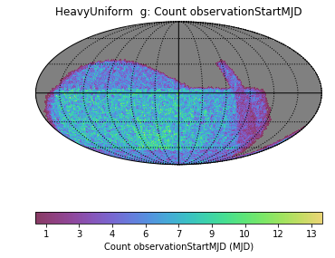| | 
|RA,Dec z |  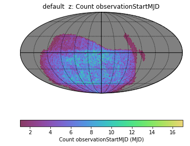|  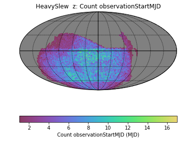|  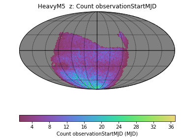|  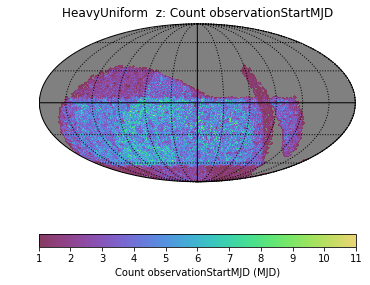| 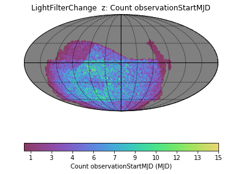| 
Hourglass | 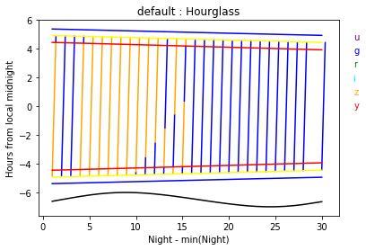|  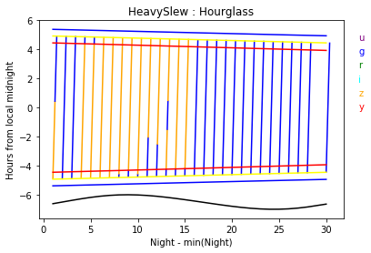|  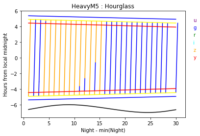|  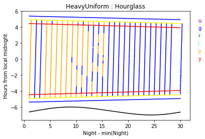| 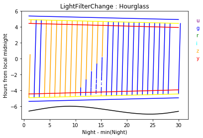| 

Many of the behaviors we saw in the one-fitler example still apply here. Now, putting a large emphasis on survey uniformity causes numerous filter changes that lowers the overall efficeincy. Removing the weight on the basis function that supresses filter changes results in several periods of filter thrashing. Thus the Filter Change plots look similar to the Baseline, but the total number of observations is lower due to the lost time changing filters.

